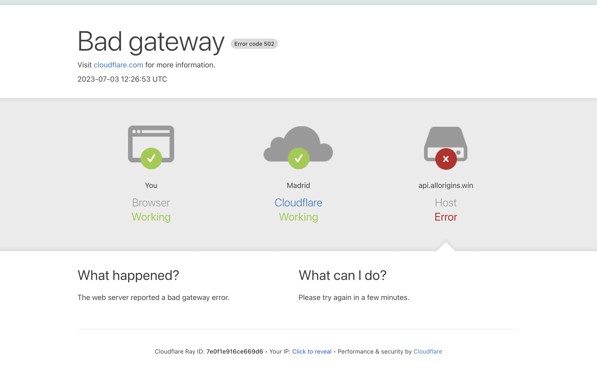

## Demo

Due to proxy CORS server failure i made a little temporary changes

visit this page to requests temporary access to the new proxy CORS

<a href="https://cors-anywhere.herokuapp.com/corsdemo">cors-anywhere.herokuapp.com</a>
<h1>API STATUS:</h1>

visit \
first visit the page to requests temporary access to the new proxy CORS!! \
https://podcaster-omega.vercel.app/ \

## Available Scripts

In the project directory, you can run:

### `Start`

git clone https://github.com/feedmelab/inditex_podcaster.git \
cd inditex_podcaster

### `npm install`

Install all the dependencies using npm \

### `npm run start`

Runs the app in the development mode.\
it opens [http://localhost:9000](http://localhost:9000) in your browser.

The page will reload when you make changes.\
You may also see any lint errors in the console.

### `npm run test`

Launches the test runner in the interactive watch mode.\

### `npm run build`

After build starts an express server to preview application.(You must install express: npm i express),
it opens [http://localhost:3000](http://localhost:3000) in your browser.

Builds the app for production to the `build` folder.\
It correctly bundles React in production mode and optimizes the build for the best performance.

The build is minified and the filenames include the hashes.\
Your app is ready to be deployed!
